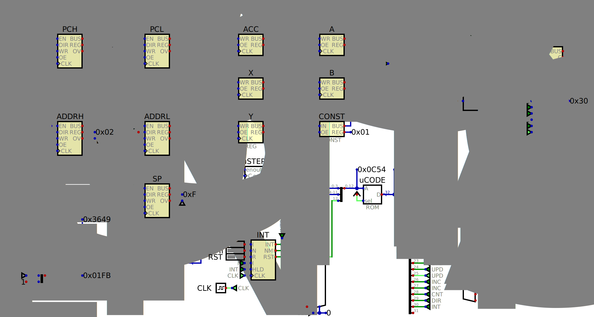

# A Simple 6502 implementation for [Digital](https://github.com/hneemann/Digital)

This implementation aims simplicity for educational purposes.

It is fully 6502 compatible and passes all functional tests from [Klaus Dormann's test suite](https://github.com/Klaus2m5/6502_65C02_functional_tests), although it is **NOT** cycle exact with the original 6502. (The actual cycles for each opcode can be seen in the [microcode ROM file](ucode/ucode.hex)).

The microcode is generated by a [simple C program](ucode/ucode.c) and can be freely rewritten and experimented with. (Use any C compiler, but it has been only tested with GCC.)

The interrupts are handled by injecting the **BRK** opcode just in the original CPU. (NOTE: The **NMI** is not edge sensitive yet.)

To start open the [cpu.dig](cpu.dig) file in [Digital](https://github.com/hneemann/Digital). The test suite will be loaded into the RAM and the simulation can be started. (The test suite runs quite a long time but when it finishes it loads ASCII `'E'($45)`, `'N'($4E)`, `'D'($44)` into the registers `A` `X` and `Y` and the `PC` loops around `$34DE`.)

There is also a [branch](../peripheral) with the CPU as a sub-circuit and a terminal as I/O peripheral. In this branch the test suit outputs to the terminal.

Unfortunately Digital does not allow to "dive" into a sub-circuit during the simulation, but if you right click on the RAM you can view it's contents updating during the simulation.

You will need:
- [Helmut Neemann's Digital simulator](https://github.com/hneemann/Digital) to run the circuit
- A C compiler if you want to change the microcode easily
- A 6502 assembler if you want to run your own 6502 code

Inspirations and informations are taken from:
- [Ben Eater's YouTube channel](https://www.youtube.com/@BenEater)
- [Dr. Matt Regan's YouTube channel](https://www.youtube.com/@DrMattRegan)
- [The 6502 Instruction Set reference at mass:werk](https://www.masswerk.at/6502/6502_instruction_set.html)