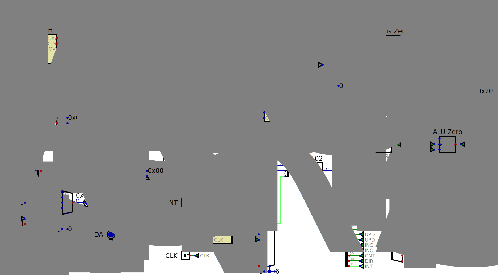
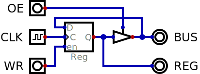
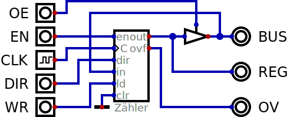
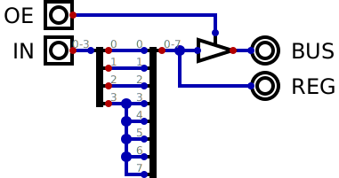
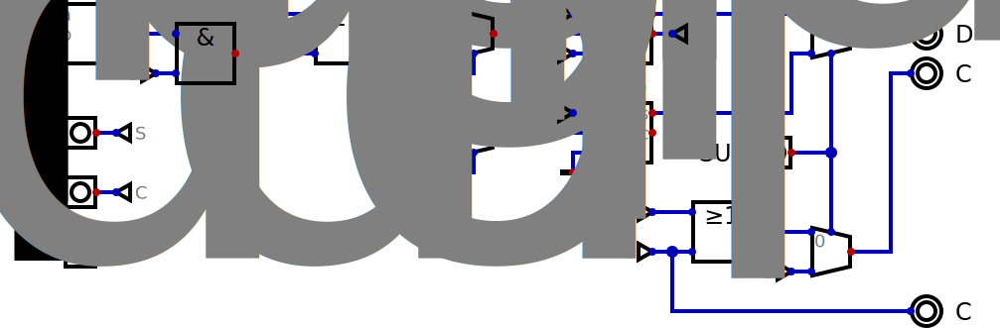
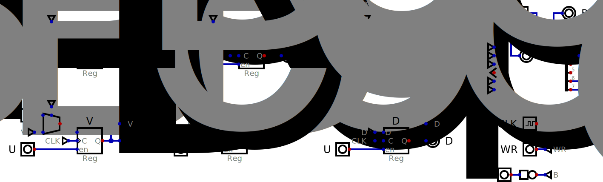
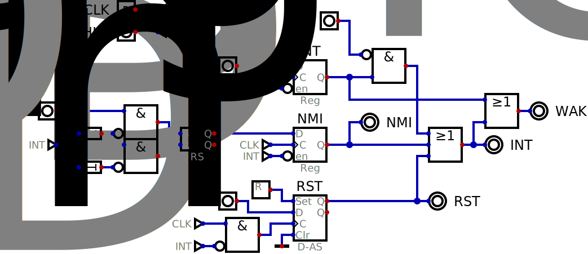
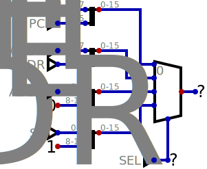
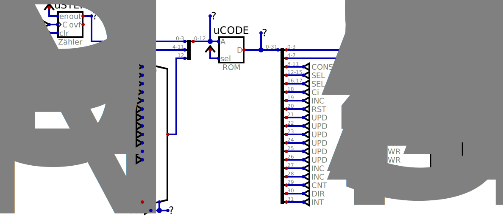

# A Simple 6502 / 65C02 implementation for [Digital](https://github.com/hneemann/Digital)

The 8-bit CPU architecture. (The 6502 CPU after the reset signal injecting opcode `00` for reset handling.)

# Basic Register building blocks
For simplicity most CPU registers are either built from [simple registers](#simple-registers) or [counter registers](#counter-registers). There is also a [constant register](#constant-register).

## Simple Registers

Simple registers are constructed from an **8-bit** clocked D flip-flop and a line driver. When the `OE` signal is high the flip-flop will output it's content on the `BUS` connection. When the `WR` signal is high the flip-flop will update it's content from the `BUS` connection on the next rising `CLK` signal.

The following registers are made of **simple** registers:
- The accumulator `ACC`
- The index register `X`
- The index register `Y`
- First operand of the `ALU A`
- Second operand of the `ALU B`

## Counter Registers

Counters can receive and output values from and to the `BUS` like [simple registers](#simple-registers). In addition they can count up and down. This comes very handy for registers which have to increment and/or decrement their values like the **stack pointer**, **program counter** and the **address register**. If the counting is enabled with the `EN` signal, the register will increment it's value on the next rising `CLK` signal when the `DIR` signal is low and decrement if the the `DIR` signal is high. An over- or underflow on the next clock edge is signaled by the `OV` signal.

The following registers are made of **counter** registers:
- The program counter registers `PCH` and `PCL`
- The address registers `ADDRH` and `ADDRL`
- The stack pointer register `SP`

## Constant Register

The constant register outputs the 4 bit signed value from `IN` as a sign extended 8 bit value to the `BUS`. Among other uses it is needed to generate the interrupt and reset vector ram addresses. It is also used to inject the `BRK` opcode for interrupts and reset.

| `IN` | `REG` |
|-|-|
| 0 | 0 |
| 1 | 1 |
| 2 | 2 |
| 3 | 3 |
| 4 | 4 |
| 5 | 5 |
| 6 | 6 |
| 7 | 7 |
| 8 | F8 |
| 9 | F9 |
| 10 | FA |
| 11 | FB |
| 12 | FC |
| 13 | FD |
| 14 | FE |
| 15 | FF |

# The Arithmetic Logic Unit (ALU)

The 8-Bit ALU is highly specializied to perform operations needed by the 6502 and 65C02 opcodes.

| Pin(s) | Type | Description |
|-|-|-|
| A | I | First Operand |
| B | I | Second Operand |
| Ci | I | Carry input (Binary or BCD) |
| Di | I | BCD operation select (Addition / Subtraction) |
| OE | I | Enable `BUS` output |
| Op | I | ALU Operation (See below) |
| Y | O | Result |
| BUS | Z | Result (Tri-State) |
| Co | O | Carry output (Binary or BCD) |
| V | O | Overflow bit (See below) |

| `Op` | Operation | Description |
|-|-|-|
| 0 | Y = A + B | Binary add, ignores Di input |
| 1 | Y = A - B | Binary subtract, ignores Di input |
| 2 | Y = A + B | Binary or BCD add, BCD if Di high, binary otherwise |
| 3 | Y = A - B | Binary or BCD subtract, BCD if Di high, binary otherwise |
| 4 | Y = A & B | ALU AND |
| 5 | Y = A \| B | ALU OR |
| 6 | Y = A ^ B | ALU XOR |
| 7 | Y = A >> 1 | ALU Shift Right |
| 8 | Y = A & ~(1 << B) | ALU Clear Bit B in A (65C02) |
| 9 | Y = A \| (1 << B) | ALU Set Bit B in A (65C02) |
| 10 | Y = A & (1 << B) | ALU Test Bit B in A (65C02) |
| 11 | Y = ~A | ALU Invert A (65C02) |

The Overflow Bit (`V`) indicates a signed 8-Bit overflow after a binary addition or subtraction. This means when both operands `A` and `B` have the same sign bit, the result `Y` must also have the same sign bit as the operands. In this case the `V` bit is zero and no overflow occurred.

V = (~ASI & ~BSI & YSI) | (ASI & BSI & ~YSI)

| ASI | BSI | YSI | V |
|-|-|-|-|
| 0 | 0 | 0 | 0 |
| 0 | 0 | 1 | 1 |
| 0 | 1 | 0 | 0 |
| 0 | 1 | 1 | 0 |
| 1 | 0 | 0 | 0 |
| 1 | 0 | 1 | 0 |
| 1 | 1 | 0 | 1 |
| 1 | 1 | 1 | 0 |

## The BCD Correction Unit

This unit corrects the result of an addition or subtraction of two 4 bit BCD numbers. It adds or subtracts 6 to or from an invalid BCD result (>9).

# The Processor Status Register (Flags)

# The Interrupt and Reset System

# The Address Multiplexer

# The Control Logic

## The Instruction Register

## The Micro-step Counter

## The Flags Input Multiplexer

## The Microcode ROM
